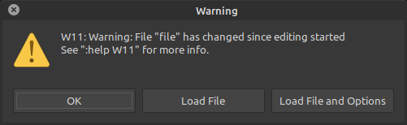
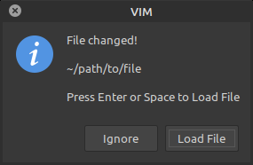
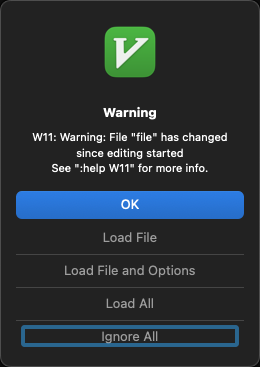
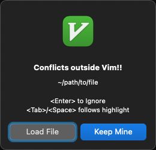

##################################################
File-Changed Prompt with "Load File" as Default 🗯
##################################################

This plugin change the default file-changed prompt so that
pressing ``<Enter>`` loads the changes.

- The stock Vim prompt ignores changes by default (it does
  not update the local buffer with the external changes).

- And if you decide you want the buffer version back, it's
  easy to restore your local changes — just ``:undo`` (or
  press ``<Ctrl-Z>`` if you fly with |mswin.vim|_).

.. |mswin.vim| replace:: ``mswin.vim``
.. _mswin.vim: https://vimhelp.org/gui_w32.txt.html#mswin.vim

(Gory) Details
==============

By default, Vim prompts you if a buffer you're working on
was changed by an external program.

But the default action (if you press ``<Enter>``) is to ignore
changes.

At least in the author's experience, I'd usually rather load
the changes. So I made this plugin to facilitate that workflow.

On Linux
--------

Here's a look at the default prompt on Linux Mint MATE:

You'll notice the *ignore* action is labeled simply "OK",
which you can pick by pressing ``<Enter>`` or ``<Space>``, or
by using the ``<Alt-O>`` accelerator.

- If you'd like to pick "Load File", you can ``<Tab>`` first,
  and then press ``<Enter>`` or ``<Space>``, or you can use
  the ``<Alt-L>`` or ``<Alt-A>`` accelerator.

The prompt message is also a little wordy (IMHO).

This plugin changes the prompt thusly:

So now to load the changes, simple press ``<Enter>`` or
``<Space>``, or use the ``<Alt-L>`` accelerator.

The prompt message is also a smidgen more concise.

On macOS
--------

The gameplay on macOS is slightly different, and perhaps
not as intuitive if you're more familiar with the Linux UX.

Here's what the default prompt looks like in `MacVim <https://macvim.org/>`__:

If you're not familiar with macOS dialog wiring:

- The button with the *blue background* is picked
  when you press ``<Enter>``.

- The button with the *blue border* is picked when
  you press ``<Space>``.

- You can move the selected button with ``<Tab>``.

  - Regardless of the selected button, ``<Enter>`` will
    *always* pick the "OK" button.

- There are no accelerators defined (e.g., nothing like
  the ``<Alt-L>`` you can use on Linux).

This plugin changes the prompt thusly:

The prompt text is also less wordy than the default,
and you'll see a helpful little hint added to
remind you how ``<Enter>`` and ``<Tab>``/``<Space>`` work on macOS.

- And if you've read |help-W11|_ once, you probably
  don't need to be reminded of it every time.

.. |help-W11| replace:: ``:help W11``
.. _help-W11: https://vimhelp.org/message.txt.html#W11

Some changes are automatically reloaded
---------------------------------------

Vim identifies at least six different types of changes:

- The file on disk was deleted while a buffer is open.

- The file timestamp was changed.

- The file permissions were changed.

- The file contents were changed, but the buffer has
  not been modified (|help-modified|_).

- The file contents were changed and the buffer has
  local modifications.

- The file on disk was *created* after a buffer with
  that path was opened.

  - This is actually a different prompt altogether
    that is not scriptable (|help-W13|_).

If Vim notices that only the timestamp has changed, you
won't notice. It will ignore the event and move on.

- But it will notify this plugin. And it'll print a
  short `message
  <https://vimhelp.org/message.txt.html#%3Amessages>`__
  to bleep you, |because-what-the-hay|_ (but it won't
  prompt you).

- For you |rebasers|_ out there, this event occurs
  frequently when you rebase history.

If Vim notices that the permissions have changed,
the default is to always prompt you.

- This plugin will *not* prompt you when permissions
  change. [Although maybe it should, or at least if
  the file is no longer writable or readable by the
  user. But this seems like such a rare use case, we're
  not gonna worry about that now. But please open an
  `Issue
  <https://github.com/embrace-vim/vim-better-file-changed-prompt/issues>`__
  if this impacts you negatively.]

For the remaining three cases — file deleted, changed,
or conflicts — this plugin will prompt you as described
earlier.

.. |help-modified| replace:: ``:help modified``
.. _help-modified: https://vimhelp.org/options.txt.html#%27modified%27

.. |help-W13| replace:: ``:help W13``
.. _help-W13: https://vimhelp.org/message.txt.html#W13

.. |rebasers| replace:: *rebasers*
.. _rebasers: https://git-scm.com/docs/git-rebase

.. |because-what-the-hay| replace:: *because what the hay*
.. _because-what-the-hay: https://www.google.com/search?q=define+hay

Reference
=========

Relevant Vim documentation for the *endlessly curious*:

- |help-FileChangedShell|_

- |help-fcs_choice|_

- |help-fcs_reason|_

- |help-timestamp|_

- Vim Tip: *File no longer available - mark buffer modified*, by *Ewfalor*, 2008:

  `https://vim.fandom.com/wiki/File_no_longer_available_-_mark_buffer_modified
  <https://vim.fandom.com/wiki/File_no_longer_available_-_mark_buffer_modified>`__

  - This tip provides a simple ``FileChangedShell`` hander that was the basis
    for this project's `file-changed handler
    <https://github.com/embrace-vim/vim-better-file-changed-prompt/blob/release/autoload/embrace/fcs_handler.vim>`__.

.. |help-FileChangedShell| replace:: ``:h FileChangedShell``
.. _help-FileChangedShell: https://vimhelp.org/autocmd.txt.html#FileChangedShell

.. |help-fcs_choice| replace:: ``:h v:fcs_choice``
.. _help-fcs_choice: https://vimhelp.org/eval.txt.html#v%3Afcs_choice

.. |help-fcs_reason| replace:: ``:h v:fcs_reason``
.. _help-fcs_reason: https://vimhelp.org/eval.txt.html#v%3Afcs_reason

.. |help-timestamp| replace:: ``:h timestamp``
.. _help-timestamp: https://vimhelp.org/editing.txt.html#timestamp

Related Projects
================

- ``interuptless.vim`` — *Makes vim interrupt you less*

  https://github.com/vim-utils/vim-interruptless

- ``vim-autoread`` — Have Vim automatically reload a
  file that has changed externally

  https://github.com/djoshea/vim-autoread

Installation
============

.. |help-packages| replace:: ``:h packages``
.. _help-packages: https://vimhelp.org/repeat.txt.html#packages

.. |INSTALL.md| replace:: ``INSTALL.md``
.. _INSTALL.md: INSTALL.md

Take advantage of Vim's packages feature (|help-packages|_)
and install under ``~/.vim/pack``, e.g.,:

.. code-block::

  mkdir -p ~/.vim/pack/embrace-vim/start
  cd ~/.vim/pack/embrace-vim/start
  git clone https://github.com/embrace-vim/vim-better-file-changed-prompt.git

  " Build help tags
  vim -u NONE -c "helptags vim-better-file-changed-prompt/doc" -c q

- Alternatively, install under ``~/.vim/pack/emrace-vim/opt`` and call
  ``:packadd vim-better-file-changed-prompt`` to load the plugin on-demand.

For more installation tips — including how to easily keep the
plugin up-to-date — please see |INSTALL.md|_.

Attribution
===========

.. |embrace-vim| replace:: ``embrace-vim``
.. _embrace-vim: https://github.com/embrace-vim

.. |@landonb| replace:: ``@landonb``
.. _@landonb: https://github.com/landonb

The |embrace-vim|_ logo by |@landonb|_ contains
`coffee cup with straw by farra nugraha from Noun Project
<https://thenounproject.com/icon/coffee-cup-with-straw-6961731/>`__
(CC BY 3.0).

